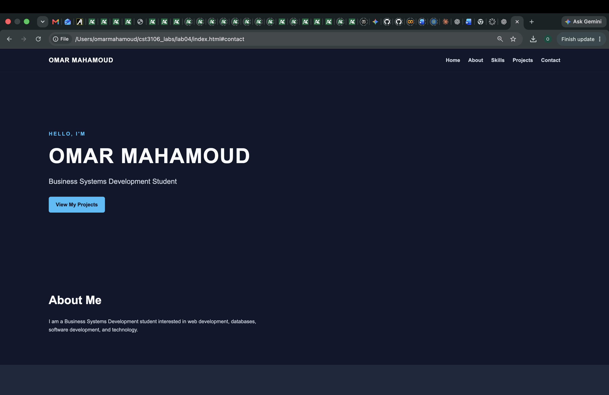
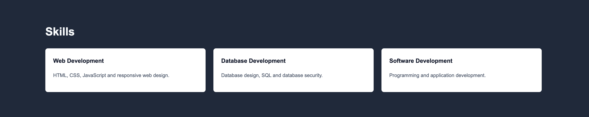
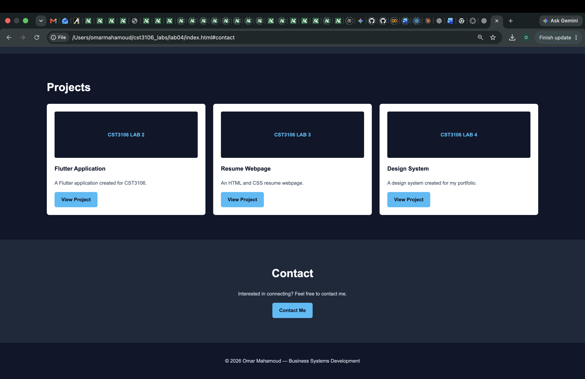

# Omar Mahamoud — Portfolio Design System

## 1. Overview

This design system defines the visual style and layout guidelines for my student portfolio website. The portfolio builds on my resume and will be updated throughout the semester as I complete new projects.

The design focuses on a modern, clean, and professional technology-oriented appearance. The website uses a dark navy background, blue accent colors, light text, and reusable components to keep the design consistent across the site.

---

## 2. Typography

The portfolio uses **Arial, sans-serif** as the primary font.

### Headings
- Font: Arial
- Weight: Bold
- Used for page titles and section headings
- Large headings are used to create a clear visual hierarchy

### Body Text
- Font: Arial
- Weight: Normal
- Used for descriptions, paragraphs, and supporting information

Using one main font family keeps the portfolio clean and consistent while maintaining good readability.

---

## 3. Color Palette

The portfolio uses a dark navy and blue color scheme.

| Purpose | Color | Hex Code |
|---|---|---|
| Main Background | Dark Navy | `#0F172A` |
| Secondary Background | Slate | `#1E293B` |
| Accent | Light Blue | `#38BDF8` |
| Main Text | Off White | `#F8FAFC` |
| Secondary Text | Light Slate | `#CBD5E1` |
| Cards | White | `#FFFFFF` |

### Color Usage

- **Dark Navy** is used as the primary page background.
- **Slate** is used for secondary areas and supporting elements.
- **Light Blue** is used for buttons, links, highlights, and other important interactive elements.
- **Off White** is used for main text against dark backgrounds.
- **Light Slate** is used for secondary or less important text.
- **White** is used for content cards to create contrast against the dark background.

---

## 4. Page Layout

The portfolio uses a single-page layout with multiple clearly separated sections.

The main page contains:

1. Header and Navigation
2. Hero Section
3. About Section
4. Skills Section
5. Projects Section
6. Contact Section
7. Footer

The layout is designed to be simple to navigate while providing enough space for portfolio content and project screenshots.

---

## 5. Header and Navigation

The header is positioned at the top of the page and contains my name and the main navigation.

### Navigation Items

- Home
- About
- Skills
- Projects
- Contact

The navigation uses a simple horizontal layout. Links use the accent blue color when highlighted or hovered.

The header provides consistent navigation throughout the portfolio and allows visitors to quickly move between sections.

---

## 6. Hero Section

The hero section is the first major section visitors see.

It contains:

- My name
- My program/role
- A short introduction
- A button linking to my projects

The hero section uses large typography to make my name and role immediately visible.

Example:

**OMAR MAHAMOUD**

*Business Systems Development Student*

**View My Projects**

---

## 7. About Section

The About section provides a short introduction about me and my background.

This section uses:

- A large section heading
- A short paragraph
- Consistent spacing between elements

The section is designed to provide visitors with basic information before they view my skills and projects.

---

## 8. Skills Section

The Skills section uses reusable cards to display technical and professional skills.

Example categories include:

- Web Development
- Database Development
- Software Development

Each skill card follows the same design so that the portfolio remains consistent.

### Reusable Skill Card

Each card contains:

- A category title
- A short description
- Consistent padding and spacing

The same CSS card style can be reused for additional skills.

---

## 9. Projects Section

The Projects section displays completed coursework and other projects.

Each project is displayed using a reusable project card.

### Project Card

Each project card contains:

- Project image or screenshot
- Project title
- Short description
- Project link or button

Example projects may include:

- CST3106 Lab 2 — Flutter
- CST3106 Lab 3 — Resume Webpage
- CST3106 Lab 4 — Design System
- Future coursework projects

New projects can be added using the same card design without changing the overall layout.

---

## 10. Buttons

Buttons use the portfolio's accent blue color to make important actions easy to identify.

Examples include:

- View My Projects
- View Project
- Contact Me

Buttons use consistent:

- Padding
- Border radius
- Font weight
- Hover effects

This creates a consistent interactive style throughout the website.

---

## 11. Contact Section

The Contact section provides a way for visitors to get in touch.

It may include:

- Email
- Location
- A contact button

The section follows the same typography, spacing, and color system used throughout the rest of the portfolio.

---

## 12. Footer

The footer appears at the bottom of the page.

It contains basic information such as:

- My name
- Program
- Copyright information

Example:

> © 2026 Omar Mahamoud — Business Systems Development

The footer uses a darker background and light text to visually separate it from the main content.

---

## 13. Reusable Components

The portfolio uses reusable components to maintain a consistent design.

The main reusable components are:

- Navigation links
- Buttons
- Skill cards
- Project cards
- Section headings

Using reusable components makes it easier to add new content throughout the semester while keeping the website visually consistent.

---

## 14. Mock-ups

The following screenshots demonstrate how the design system is applied to the portfolio website.

### Portfolio Homepage

The homepage mock-up demonstrates the overall layout, including the navigation bar, hero section, and introduction.

### Skills Section

The skills section demonstrates the reusable card component used to display different technical skills.

### Projects Section

The projects section demonstrates the reusable project card component used to display portfolio projects.

---

## 15. Design Summary

The portfolio design uses a modern dark theme with blue accents, simple typography, reusable components, and a clear single-page layout.

The design system provides a consistent foundation for the portfolio and allows new projects and content to be added throughout the semester without changing the overall visual style.